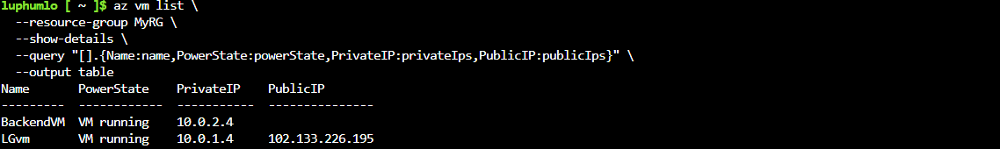
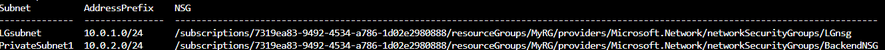
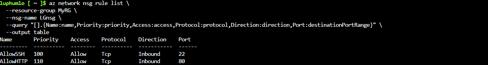
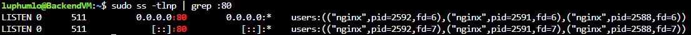
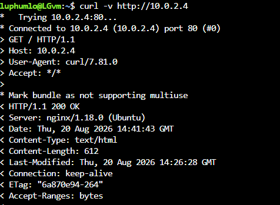

# azure-secure-vnet-architecture-
Azure project demonstrating secure VNet architecture, subnet segmentation, NSGs, private VM communication, and Nginx.

##Project Overview 

This project demonstrates the deployment and configuration of a secure network architecture in Microsoft Azure using Virtual Networks, subnets, Network Security Groups (NSGs), Linux virtual machines, and Nginx.
The environment consists of two Linux virtual machines deployed into separate subnets within the same virtual network:

LGvm – Frontend/management VM
BackendVM – Backend web server

The main objective was to configure network segmentation and security controls while allowing the frontend VM to communicate with the backend VM using its private IP address.
The backend VM hosts an Nginx web server, which was successfully accessed from LGvm over the private network.

##Project Objectives
1)Create an Azure Virtual Network with multiple subnets

2)Deploy Linux virtual machines into separate subnets

3)Configure Network Security Groups (NSGs)

4)Control inbound network traffic using NSG rules

5)Install and configure Nginx on the backend VM

6)Test private VM-to-VM communication

7)Verify HTTP connectivity using curl

8)Use Azure CLI and Linux Bash commands to manage and troubleshoot the environment

## Network Configuration

The Azure environment was deployed inside a single Virtual Network with separate subnets for the frontend and backend workloads.

### Virtual Machines

| VM        | Role                   | Private IP | Public IP         |
| --------- | ---------------------- | ---------- | ----------------- |
| LGvm      | Frontend/management VM | `10.0.1.4` | `102.133.226.195` |
| BackendVM | Backend web server     | `10.0.2.4` | None              |

### Subnets

| Subnet         | Address Range | Purpose                |
| -------------- | ------------- | ---------------------- |
| LGsubnet       | `10.0.1.0/24` | Frontend/management VM |
| PrivateSubnet1 | `10.0.2.0/24` | Backend VM             |

The backend VM was placed in a separate subnet and accessed using its private IP address rather than a public IP.

### Network Security Groups

Network Security Groups were used to control inbound traffic.

| Rule      | Priority | Protocol | Direction | Port | Access |
| --------- | -------: | -------- | --------- | ---: | ------ |
| AllowSSH  |      100 | TCP      | Inbound   |   22 | Allow  |
| AllowHTTP |      110 | TCP      | Inbound   |   80 | Allow  |
### VM Network Configuration



### Subnet Configuration



### Network Security Group Rules


SSH access was permitted on port 22 for administration, while HTTP traffic was permitted on port 80 for the Nginx web server.

## Testing and Validation

After configuring the virtual machines, subnets, and Network Security Groups, I tested communication between the frontend and backend VMs using the backend VM's private IP address.

### Private HTTP Connectivity Test

From **LGvm**, I used `curl` to send an HTTP request to the backend VM:

```bash
curl -v http://10.0.2.4
```

The connection was successful:

```text
Connected to 10.0.2.4 port 80
HTTP/1.1 200 OK
Server: nginx/1.18.0 (Ubuntu)
```
### Nginx Listening on Port 80



### Private Connectivity Test


This confirmed that:

* LGvm could reach BackendVM using its **private IP address**.
* Network traffic between the two subnets was functioning.
* Nginx was accessible on **TCP port 80**.
* The backend VM successfully returned an HTTP response.

### Nginx Verification

On BackendVM, I verified that Nginx was actively listening on port 80:

```bash
sudo ss -tlnp
```

The output showed Nginx listening on:

```text
0.0.0.0:80
[::]:80
```

This confirmed that the Nginx web server was running and accepting HTTP connections.

### Result

The private connectivity test successfully demonstrated communication between the two Azure VMs without requiring a public IP address on the backend VM.

## Skills Demonstrated

Through this project, I gained practical experience with:

* **Azure Virtual Networks (VNets)**
* **Subnet design and segmentation**
* **Network Security Groups (NSGs)**
* **Inbound traffic rules**
* **Private IP addressing**
* **Azure Linux Virtual Machines**
* **Ubuntu Linux administration**
* **Nginx web server configuration**
* **SSH**
* **HTTP and TCP networking**
* **Azure CLI**
* **Bash**
* **Network troubleshooting**

## Key Lessons Learned

### 1. Subnet Segmentation

I learned how a VNet can be divided into multiple subnets to separate workloads and organize network resources.

### 2. Private Communication

I learned that Azure VMs within the same VNet can communicate using their private IP addresses without requiring public IP connectivity between the workloads.

### 3. Network Security Groups

I learned how NSGs control network traffic using rules based on factors such as:

* Source
* Destination
* Protocol
* Port
* Direction
* Priority
* Access

### 4. Troubleshooting

When connectivity did not initially work as expected, I used Azure CLI and Linux networking commands to investigate the configuration.

This helped me understand that successful application connectivity depends on multiple layers, including the VM, service, listening port, subnet configuration, and network security rules.

## AZ-104 Concepts Practiced

This project gave me practical experience with several concepts relevant to the **Microsoft Azure Administrator (AZ-104)** certification:

* Configure virtual networking
* Configure and manage subnets
* Configure network security
* Manage Azure virtual machines
* Manage Linux resources
* Troubleshoot network connectivity
* Use Azure CLI and Bash
